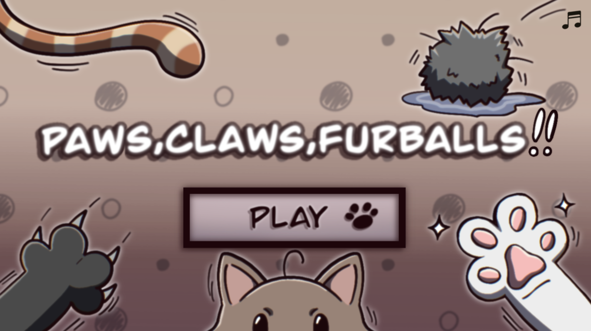
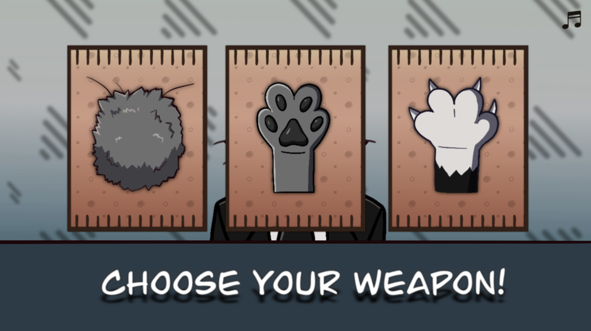

# 🐾 Paws, Claws & Furballs ✊🐾✋🐾✌️

Welcome to **Paws, Claws & Furballs**, the cutest twist on the classic Rock-Paper-Scissors!  
Instead of boring hand signs, you’ll be battling with fluffy **furballs**, soft **paws**, and sharp **claws**.  
Every match is a best of 3 - win, lose, or draw, the cats decide your fate! 🐱

---

##  How to Play

1. **Start the game** and let the cats guide you through a quick **loading screen**.  
2. In the **Main Menu**, press **Play**. 
3. Read the **Instructions** 
4. When ready, choose your weapon:  
   - **Furball = Rock** ✊  
   - **Paw = Paper** ✋  
   - **Claws = Scissors** ✌️  
5. Watch the **animated countdown** (“3…2…1… GO!”) as the cats face off.  
6. The cards slide in dramatically, and the result is revealed: **YOU WIN**, **YOU LOSE**, or **DRAW**.  

Each game is **3 rounds**. At the end, you’ll see a **Final Results screen**:  
-  Win more rounds than the computer: **Victory Cat!**  
-  Lose more rounds: **Sad Kitty…**  
-  Equal score: **A Cat-tied Draw!**

Then you can **Play Again** and challenge your feline rival once more!

---

##  Features

- **Adorable cat theme** for a timeless classic.
- **3-round matches** (best of three).
- **Animated countdown and sliding cards** for dramatic showdowns.
- **Hover and click sounds** to make every action feel playful.

- **Background music toggle** (pause/unpause with one click).

---

##  Requirements

- Python 3.8+
- [Pygame](https://www.pygame.org/) (`pip install pygame`)

---

